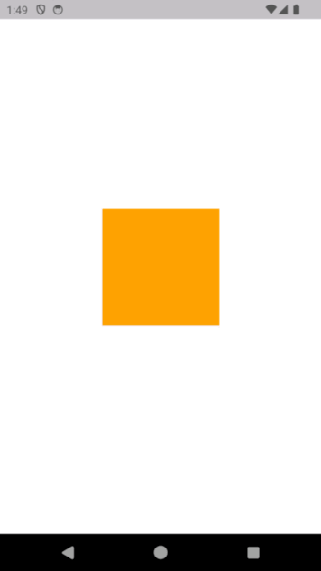

# 🔍 Auto Zoom Reset

[](https://pub.dev/packages/auto_zoom_reset)
[](https://opensource.org/licenses/MIT)

A Flutter package that provides an **InteractiveViewer with automatic zoom reset functionality**. Perfect for image galleries, product viewers, and any content that needs pinch-to-zoom with auto-reset behavior.


*Simple example showing the AutoZoomReset widget in action*
<p align="left">
  
</p>

## ✨ Features

- 🔄 **Automatic Reset**: Automatically returns to original scale and position after zoom interaction
- ⏱️ **Customizable Timing**: Configure reset delay and animation duration
- 🎨 **Smooth Animations**: Beautiful reset animations with customizable curves
- 📊 **Zoom Indicator**: Optional visual feedback showing current zoom percentage  
- 🎯 **Flexible Configuration**: Extensive customization options for different use cases
- 📱 **Touch Optimized**: Responsive to pinch gestures and multi-touch interactions
- 🚀 **Performance**: Lightweight and efficient implementation
- 📦 **Easy Integration**: Drop-in replacement for InteractiveViewer

## 🚀 Quick Start

Add this to your package's `pubspec.yaml` file:

```yaml
dependencies:
  auto_zoom_reset: ^1.0.0
```

Then run:
```bash
flutter pub get
```

## 📖 Basic Usage

### Simple Implementation

```dart
import 'package:auto_zoom_reset/auto_zoom_reset.dart';

// Basic usage with default settings
AutoZoomReset(
  child: Container(
    width: 200,
    height: 200,
    color: Colors.orange,
    child: Center(
      child: Text('Pinch to Zoom!'),
    ),
  ),
)

// Or use the simplified widget
SimpleAutoZoomReset(
  showIndicator: true,
  child: Image.asset('assets/product_image.jpg'),
)
```

### 📱 Live Example

The screenshot above shows a simple orange container that can be pinched to zoom. The widget automatically resets to its original size after the user releases their fingers, providing a smooth and intuitive user experience.

### Advanced Configuration

```dart
AutoZoomReset(
  // Timing Configuration
  resetDelay: Duration(milliseconds: 1000),      // Wait 1s before reset
  resetDuration: Duration(milliseconds: 500),    // 500ms reset animation
  resetCurve: Curves.bounceOut,                  // Bouncy animation
  
  // Scale Limits
  minScale: 0.8,
  maxScale: 4.0,
  
  // Visual Feedback
  showZoomIndicator: true,
  indicatorColor: Colors.black54,
  
  // Callbacks
  onZoomStart: () => print('Zoom started'),
  onZoomEnd: () => print('Zoom ended'),
  onScaleChanged: (scale) => print('Scale: $scale'),
  
  child: YourWidget(),
)
```

## 🎯 Use Cases

### 📸 Image Gallery
Perfect for photo galleries where users want to inspect details but prefer images to return to normal size automatically.

```dart
AutoZoomReset(
  resetDelay: Duration.zero,  // Immediate reset
  showZoomIndicator: true,
  child: Image.network(imageUrl),
)
```

### 🛍️ Product Viewer
Ideal for e-commerce apps where customers zoom into product images for details.

```dart
AutoZoomReset(
  resetDelay: Duration(milliseconds: 800),
  resetCurve: Curves.easeInOut,
  maxScale: 3.0,
  child: ProductImage(product: product),
)
```

### 📋 Document Viewer
Great for documents, charts, or any content requiring temporary magnification.

```dart
AutoZoomReset(
  resetDelay: Duration(milliseconds: 1500),
  showZoomIndicator: true,
  child: DocumentWidget(document: doc),
)
```

## 🎛️ Configuration Options

| Property | Type | Default | Description |
|----------|------|---------|-------------|
| `child` | `Widget` | **required** | The widget to be displayed and interacted with |
| `zoomEnabled` | `bool` | `true` | Enable/disable zoom and pan functionality |
| `resetDuration` | `Duration` | `300ms` | Duration of the reset animation |
| `resetCurve` | `Curve` | `Curves.easeInOut` | Animation curve for reset |
| `resetDelay` | `Duration` | `500ms` | Delay before auto-reset starts |
| `minScale` | `double` | `0.8` | Minimum scale factor |
| `maxScale` | `double` | `4.0` | Maximum scale factor |
| `constrained` | `bool` | `true` | Whether to enable boundary constraints |
| `showZoomIndicator` | `bool` | `false` | Show zoom percentage indicator |
| `indicatorColor` | `Color` | `Color(0x33FFFFFF)` | Color of the zoom indicator |

### 📞 Callbacks

| Callback | Description |
|----------|-------------|
| `onZoomStart` | Called when zoom interaction begins |
| `onZoomEnd` | Called when zoom interaction ends |
| `onResetStart` | Called when reset animation starts |
| `onResetComplete` | Called when reset animation completes |
| `onScaleChanged` | Called during zoom with current scale value |

## 🎨 Animation Curves

Choose from various animation curves for different reset behaviors:

```dart
// Smooth and natural
resetCurve: Curves.easeInOut

// Bouncy and playful  
resetCurve: Curves.bounceOut

// Quick and snappy
resetCurve: Curves.fastOutSlowIn

// Custom curve
resetCurve: Curves.elasticOut
```

## 🔧 Advanced Features

### Manual Reset Control

```dart
final GlobalKey<AutoZoomResetState> zoomKey = GlobalKey();

AutoZoomReset(
  key: zoomKey,
  child: YourWidget(),
)

// Trigger manual reset
zoomKey.currentState?.reset();

// Check current state
bool isZoomed = zoomKey.currentState?.isZoomed ?? false;
double currentScale = zoomKey.currentState?.currentScale ?? 1.0;
```

### Conditional Reset

```dart
AutoZoomReset(
  resetDelay: userPreference.quickReset 
    ? Duration.zero 
    : Duration(milliseconds: 1000),
  child: content,
)
```

## 📱 Platform Support

- ✅ **iOS**: Full support with native feel
- ✅ **Android**: Optimized touch handling  
- ✅ **Web**: Mouse and touch support
- ✅ **Desktop**: Mouse wheel and trackpad support

## 🎯 Best Practices

1. **Choose appropriate reset delays** based on content type:
   - Images: 500-800ms
   - Documents: 1000-1500ms  
   - Interactive content: 300-500ms

2. **Use zoom indicators** for content where scale matters:
   - Product images
   - Technical diagrams
   - Maps

3. **Configure scale limits** based on content:
   - Photos: 0.5x to 4x
   - Text/Documents: 1x to 3x
   - UI Elements: 0.8x to 2x

## 🤝 Contributing

Contributions are welcome! Please feel free to submit a Pull Request. For major changes, please open an issue first to discuss what you would like to change.

## 👨‍💻 Author

**Mohamed Elhalawany**
- GitHub: [@Halawany1](https://github.com/Halawany1)
- Package Repository: [auto_zoom_reset](https://github.com/Halawany1/auto_zoom_reset)

## 📄 License

This project is licensed under the MIT License - see the [LICENSE](LICENSE) file for details.

## 🙏 Acknowledgments

- Built with Flutter's powerful InteractiveViewer
- Inspired by modern mobile app UX patterns
- Community feedback and contributions

---

**Made with ❤️ for the Flutter community by Mohamed Elhalawany**
